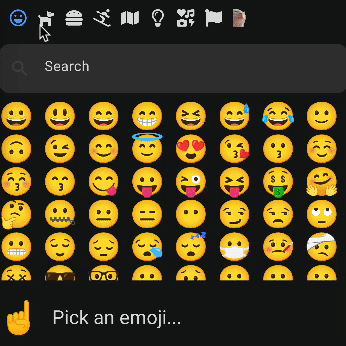

# Catjam



## Including Catjam

### Android

```groovy
implementation "xyz.ramotar.catjam:catjam:0.0.5"
```

## Using Catjam

### Picking an emoji

```kotlin
import xyz.ramotar.catjam.Emoji
import xyz.ramotar.catjam.EmojiPicker
import xyz.ramotar.catjam.Slackmoji
import xyz.ramotar.catjam.models.Emoji
import xyz.ramotar.catjam.models.EmojiPickerSize
import xyz.ramotar.catjam.EmojiPickerDefaults

EmojiPicker(
    size = EmojiPickerSize.Medium,
    colors = EmojiPickerDefaults.emojiPickerColors(),
    icon = { CustomIcon() },
    placeholder = { CustomPlaceholder() },
    customEmojis = customEmojis
) { emoji -> handleEmoji(emoji) }

```

### Rendering an emoji

```kotlin
import xyz.ramotar.catjam.Emoji
import xyz.ramotar.catjam.EmojiPicker
import xyz.ramotar.catjam.Slackmoji
import xyz.ramotar.catjam.models.Emoji
import xyz.ramotar.catjam.models.Slackmoji

@Composable
fun CustomEmoji() {
    var emoji: Emoji? by remember { mutableStateOf(null) }
    var showEmojiPicker: Boolean by remember { mutableStateOf(false) }

    Button(onClick = { showEmojiPicker = true }) {
        Text("Show Emoji Picker")
    }

    if (showEmojiPicker) {
        EmojiPicker {
            emoji = it
            showEmojiPicker = false
        }
    }

    if (emoji != null) {
        Emoji(emoji)
    }
}

// or by name

@Composable
fun Catjam() {
    Emoji(Slackmoji.Catjam)
}
```

## License

```text
Copyright (c) 2023 Matt Ramotar.
Licensed under the Apache License, Version 2.0 (the "License");
you may not use this file except in compliance with the License.
```
